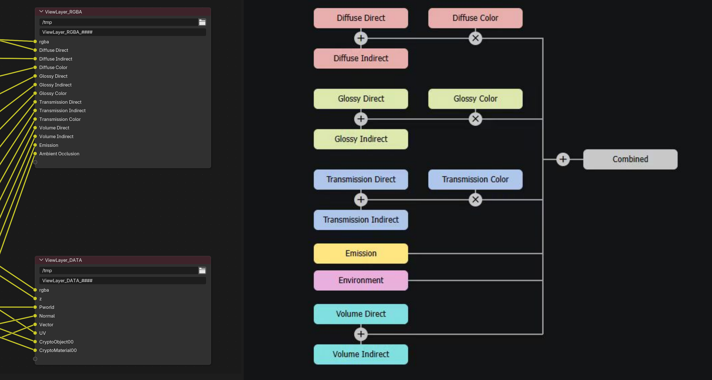
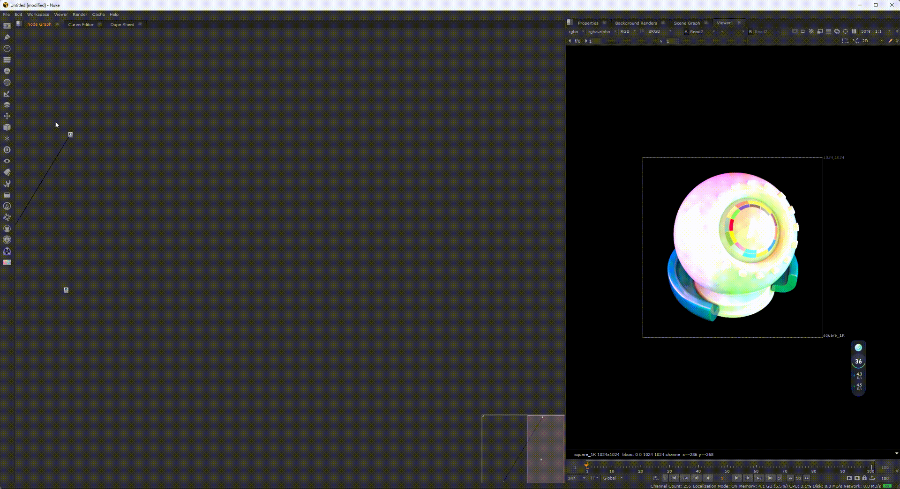
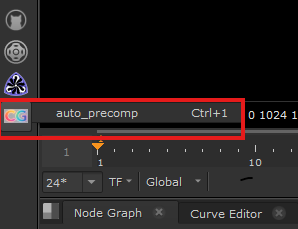
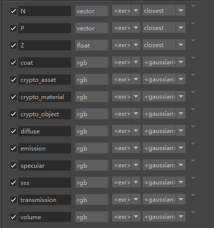
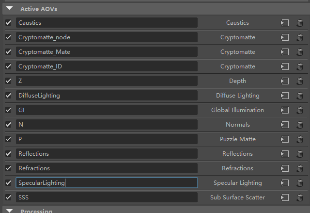

### 2026.07.26更新
⭐支持blender cycles渲染器输出的aov，合成公式参考如图

#
#
#
#

# Nuke AOV 自动预合成插件

一个用于自动创建AOV（Arbitrary Output Variables）预合成节点网络的Nuke插件。

## 功能特性

- **自动渲染器识别**：自动检测Arnold或Redshift渲染器
- **智能通道分组**：按灯光名称自动分组AOV通道
- **节点网络生成**：自动创建完整的预合成节点网络
- **特殊通道处理**：针对emission、volume等通道进行特殊处理
- **节点布局优化**：自动排列节点位置，保持清晰的视觉层次

## 效果展示

## 安装说明

1. 将 'CG_nuke' 文件夹 复制到 Nuke 的插件目录：
   - Windows: `C:\Users\<用户名>\.nuke\`
   - macOS: `~/Library/Application Support/Nuke/`
   - Linux: `~/.nuke/`

2. 在 `C:\Users\<用户名>\.nuke\menu.py`文件中添加：

nuke.pluginAddPath('CG_nuke')

3. 重启 Nuke

## 使用方法

1. 在Nuke中选中一个带有AOV通道的Read节点
2. 使用快捷键"ctrl+1"或者
在侧边栏点击‘auto_precomp’
3. 插件会自动创建预合成节点网络

## 软件测试版本
- maya 2024
- nuke 14.0v5
- python 3.10
- arnold  5.3.41
- redshift 3.5.20

## AOV参考
### Arnold

### Redshift

## 支持的渲染器
| 渲染器 | 
| Arnold | 
| Redshift |

## 支持的AOV层类型

### Arnold
- diffuse（漫反射）
- specular（高光反射）
- coat（涂层）
- transmission（透射）
- sss（次表面散射）
- volume（体积）
- emission（自发光）
- background（背景）
- indirect（间接光照）
- direct（直接光照）

### Redshift
- DiffuseLighting（漫反射光照）
- Reflections（反射光照）
- SpecularLighting（高光反射光照）
- Refractions（透射光照）
- SSS（次表面散射）
- GI（间接光照）
- Emission（自发光）
- Volume（体积）
- Caustics（焦距）

## AOV命名规范

### Arnold
通道命名格式：`{层类型}_{灯光名称}`

示例：
- `diffuse_default`
- `specular_env`
- `coat_main`

### Redshift
通道命名格式：`{层类型}{灯光名称}` 或 `{层类型}_{灯光名称}`

示例：
- `DiffuseLighting`
- `ReflectionsKeyLight`
- `SpecularLighting_Sun`

## 节点网络结构

插件创建的节点网络包含：
- **Backdrop节点**：按灯光组分组的背景框
- **Dot节点**：信号路由
- **Shuffle节点**：通道分离
- **Merge节点**：通道合并（使用plus模式）
- **Grade节点**：用于调整emission/volume/caustics通道
- **Copy节点**：处理alpha通道

## 注意事项

- 必须选中一个节点才能执行
- 节点必须包含AOV通道
- 建议使用标准的AOV命名规范
- 插件会自动处理未分组的通道
